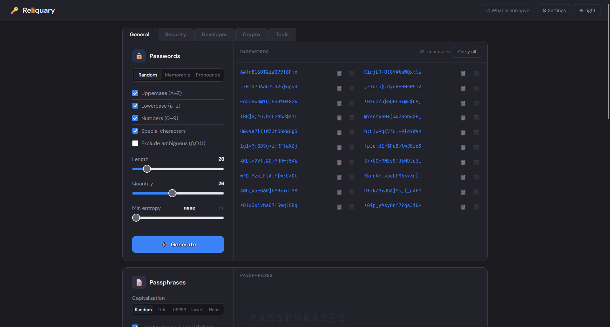

# Password Generator

A comprehensive, browser-based password and secret generator. Produces passwords, passphrases, PINs, API keys, recovery codes, UUIDs, JWTs, webhook secrets, TOTP secrets, BIP-39 mnemonics, and more — all generated client-side using the Web Crypto API. No server, no accounts, no data leaves your browser.

#### Demo:
https://badbox29.github.io/password_generator/

---

#### Screenshot


---

## Features

- **Multiple generator types** — organized into four tabs: General, Security, Developer, and Crypto
- **General tab** — Passwords (random, memorable, pronounceable), Passphrases, PINs, Usernames
- **Security tab** — API Keys, Recovery Codes, TOTP Secrets
- **Developer tab** — UUIDs, JSON Web Tokens, Webhook Secrets, Base64 Encoder
- **Crypto tab** — BIP-39 Mnemonics with optional derived seed hex
- **Entropy display** — hover tooltips on generated output show both theoretical entropy (full character set) and effective entropy (based on actual generation structure); strength ratings use effective entropy throughout
- **Minimum entropy floor** — password and passphrase generators include a floor slider that filters output to only include results meeting the set threshold; words-per-phrase and password length auto-adjust when the floor exceeds what current settings can achieve
- **Word lists** — built-in curated word list; import custom `.txt` word lists via Settings; lists are stored in localStorage and deduplicated when combined; per-generator word list selector with an "All lists" merge option
- **Settings modal** — toggle individual generators on/off; manage word lists; active generators persist across sessions
- **Tab system** — tabs appear only when non-General generators are enabled; each tab shows only its category's active generators
- **Cryptographically secure RNG** — uses `crypto.getRandomValues()` with rejection sampling to eliminate modulo bias throughout
- **Copy support** — per-item copy button and Copy All on every generator
- **Dark/light mode** — full theme toggle
- **localStorage persistence** — all settings, sliders, word list contents, and generator states saved and restored automatically with forward-compatible migration
- **About Entropy modal** — plain-English explanation of theoretical vs effective entropy, accessible from the topbar and from the minimum entropy controls
- **No build tools, no npm, no accounts** — single self-contained HTML file

---

## File Structure

```
password_generator/
├── index.html              # Entire app — HTML, CSS, and JS in one file
├── screenshot.png
└── README.md
```

---

## Setup

### 1. Get the files

Clone or download this repository. The app is a single self-contained `index.html` file with no dependencies.

Open `index.html` directly in a browser for local use, or host it on GitHub Pages (or any static host) for a permanent URL.

---

### 2. Word Lists

The app ships with a built-in curated word list of ~515 words suitable for passphrase generation. For stronger passphrases with a wider vocabulary, import a custom word list:

1. Open **Settings** → **Word Lists** → **Add list from .txt file**.
2. Select any plain text file with one word per line (minimum 20 words).
3. The list is stored in localStorage and becomes available in the word list selector on the Passphrases generator.

The included `wordlist_obscure_2000.txt` file contains ~2,000 words drawn from minority and endangered languages (Basque, Welsh, Cornish, Breton, Faroese, Quechua, Nahuatl, Guaraní, Yoruba, Malagasy, Ainu, and others) and can be imported as a custom list.

Multiple lists can be loaded simultaneously. Selecting **All lists (deduped)** in the generator merges all active lists with case-insensitive deduplication.

---

## Generator Reference

| Tab | Generator | Entropy basis |
|---|---|---|
| General | Passwords (random) | `length × log2(pool size)` |
| General | Passwords (memorable) | `log2(word list) + pad length × log2(pad pool)` |
| General | Passwords (pronounceable) | `syllables × log2(consonants × vowels) + caps + numbers` |
| General | Passphrases | `words × log2(list size) + injection + separators + caps` |
| General | PINs | `digits × log2(10)` |
| General | Usernames | — |
| Security | API Keys | `length × log2(16 or 62)` depending on format |
| Security | Recovery Codes | `chunks × size × log2(32)` (Crockford base32) |
| Security | TOTP Secrets | `byte length × 8` |
| Developer | UUIDs | — |
| Developer | JSON Web Tokens | — |
| Developer | Webhook Secrets | `length × log2(16 or 62)` depending on format |
| Developer | Base64 Encoder | `bytes × 8` (Generate mode only) |
| Crypto | BIP-39 Mnemonics | `word count × log2(2048) = word count × 11` |

Generators marked — do not display entropy tooltips (identifiers, transformations, or structured tokens where entropy measurement is not meaningful).

---

## Entropy

Each generator that produces secrets displays an entropy tooltip on hover. Two values are shown where they differ:

- **Effective entropy** — calculated from the actual generation structure (word list size, pool constraints, syllable patterns). Used for all strength ratings and minimum-entropy thresholds. This is the conservative, honest estimate.
- **Theoretical entropy** — calculated by treating every character as independently drawn from the full observed character set. Useful as an upper-bound reference; reflects what a generic brute-force tool would face with no knowledge of the generation method.

For purely random generators (API Keys, Recovery Codes, TOTP Secrets, etc.) the two values are equal and a simplified single-value tooltip is shown.

Strength tiers: **Weak** < 50 bits · **Moderate** 50–80 bits · **Strong** 80–100 bits · **Very strong** > 100 bits

---

## Security Notes

- All randomness uses `crypto.getRandomValues()` with rejection sampling — no `Math.random()` is used anywhere.
- No data leaves the browser. Nothing is sent to any server.
- Word list contents are stored in `localStorage` after import. Clear site data to remove them.
- BIP-39 mnemonics generated here are suitable for testing and non-critical use. For real wallet seed phrases, use dedicated air-gapped hardware.

---

## License

See LICENSE file.
